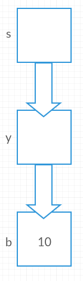

# Pre-lab Exercises - Worksheet2: Pointers #
##### Even A. Nilsen 19.08.2016 #####

## 1. Pointer Problems ##
a) `NULL` is a macro that expands to a null pointer constant. It could either be
 a literal `'0'` or an expression like `((void*)0)`. `NULL` should be used *only*
 as a pointer constant, and not to represent integer values.

b) `pointer` is a typed pointer and not an integer variable. A pointer in c points
 to a specific memory location. Since a literal number in c, it has no memory
 location and `pointer` cannot point to it. Therefore assigning `42` to `pointer`
 makes no sense.

c) `*pointer` means "follow `pointer` to the memory location it is pointing to".
 Since `pointer` is uninitialized the statement `*pointer = 42` makes no sense.

d) In this case `pointer` is a pointer to a pointer and expects to point to a
 char typed pointer, not a char variable. The following is an example of how to
 do it.
    ```
    char ch;
    char *p;
    char **pointer;
    p = &ch;
    pointer = &p;
    ```
e) You cannot assign a value to a void pointer without typecasting it. The following
 will work
    ```
    double value = 42.0;
    void *pointer = (void*)&value;
    *(double*)pointer = 84.0;
    ```
f) Pointer is not initialized. It was never given a function to point at so therefore
 it does not know what to do with its parameters.

g) First off `void (*pointer)(int)` is the wrong data type, it should be `int`.
 Second the parameter `(int)` is also the wrong data type, `function1(void)` clearly
 does not expect any arguments.

## 2. Referencing and Dereferencing ##
a)

 

b)

   

c)

   

d)

   
 

e)

   

f)

   
 

## 3. Miscellaneous Questions ##
a) `scanf()` manipulates what is at a given memory address. If you pass it an `int`
 without the `&` operator, it cannot access the variables memory location and therefore
 not manipulate it.

b) As stated in the previous answer, `scanf()` expects a memory address. By passing
 it a pointer, you are already giving it the memory location of whatever the pointer
 points to. Passing `&ptr` would mean "the address of `ptr`", this is because 
 a pointer is considered an L-value.

c) Void means that it is without any data type. Since nothing can be stored at
 a void memory address, it would have to be typecast. If that is the case, the
 typecast will tell you what type of value is stored at the address of a void
 pointer.  
 Another way would be to use `typedef` to name the pointer so that it can serve
 as a form of documentation for the reader.
    ```
    typedef void* double_ptr;
    ```
 Now `double_ptr` is equivalent to `void*`, but it can indicate what is meant to
 stored at the pointer address.

d) In C, the `char` data type is really just integers. This is because C uses
 ascii values to determine which character should be represented. If you were to
 cast an `int` variable to a `char` pointer it could work.
    ```
    int x = 97; /* ascii value of 'a' */
    char *p = (char*)&x;
    printf("%c\n", *p); /* will output 'a' */
    ```
 That means that if you typecast the pointer like I do in the following example,
 which makes no sense, the `int` pointer would be equal to the `char` pointer.
    ```
    int *ptr_int = (int*)malloc(sizeof(int));
    char *ptr_ch = (char*)malloc(sizeof(char));
    *ptr_int = 97; /* ascii value of 'a' */
    *ptr_ch = *(char*)ptr_int;
    printf("%c\n", *ptr_ch); /* will output 'a' */
    ```

